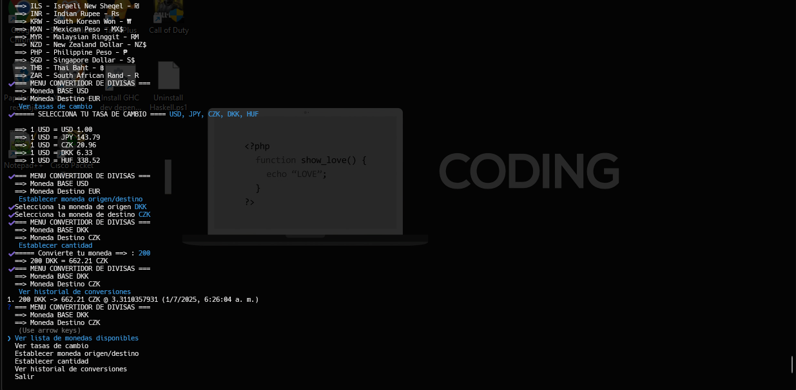

# Conversor de Monedas - Prueba Técnica

Este proyecto es un **conversor de monedas** desarrollado en Node.js, que permite consultar tasas de cambio, ver monedas disponibles y realizar conversiones de manera sencilla desde la terminal.

## Características

- Consulta de lista de monedas disponibles.
- Visualización de tasas de cambio actualizadas.
- Selección interactiva de moneda de origen y destino.
- Conversión de cantidades entre monedas.
- Historial de conversiones 
- Salida amigable y clara en la terminal.

## Uso de Inquirer

Se utilizó la librería [Inquirer](https://www.npmjs.com/package/inquirer) para mejorar la experiencia de usuario en la terminal.  
**Inquirer** permite crear menús interactivos, listas de selección, checkboxes y formularios, facilitando la gestión de la CLI (Command Line Interface) de manera efectiva y profesional.  
Gracias a Inquirer, el usuario puede navegar por las opciones del menú, seleccionar monedas y cantidades de forma intuitiva, evitando errores de tipeo y mejorando la usabilidad general del programa.

## Instalación

1. Clona este repositorio:
   ```sh
   git clone https://github.com/juanjh1/ConversorJavascript.git
   cd ConversorJavascript
   ```

2. Instala las dependencias:
   ```sh
   npm install
   ```

## Uso

Ejecuta el programa con:

```sh
 npm run start
```

Sigue las instrucciones en pantalla para seleccionar opciones y realizar conversiones.

## Tecnologías utilizadas

- **Node.js**: Entorno de ejecución para JavaScript en el servidor.
- **Inquirer**: Librería para crear interfaces de usuario interactivas en la terminal.
- *# Conversor de Monedas - Prueba Técnica

Este proyecto es un **conversor de monedas** desarrollado en Node.js, que permite consultar tasas de cambio, ver monedas disponibles y realizar conversiones de manera sencilla desde la terminal.

## Características

- Consulta de lista de monedas disponibles.
- Visualización de tasas de cambio actualizadas.
- Selección interactiva de moneda de origen y destino.
- Conversión de cantidades entre monedas.
- Historial de conversiones.
- Salida amigable y clara en la terminal.

## Uso de Inquirer

Se utilizó la librería [Inquirer](https://www.npmjs.com/package/inquirer) para mejorar la experiencia de usuario en la terminal.  
**Inquirer** permite crear menús interactivos, listas de selección, checkboxes y formularios, facilitando la gestión de la CLI (Command Line Interface) de manera efectiva y profesional.  
Gracias a Inquirer, el usuario puede navegar por las opciones del menú, seleccionar monedas y cantidades de forma intuitiva, evitando errores de tipeo y mejorando la usabilidad general del programa.

## Instalación

1. Clona este repositorio:
   ```sh
   git clone https://github.com/juanjh1/ConversorJavascript.git
   cd monedas_prueba_tecnica
   ```

2. Instala las dependencias:
   ```sh
   npm install
   ```

## Uso

Ejecuta el programa con:

```sh
npm run start
```

Correr los test:

```sh
npm run test
```

Correr el linter:

```sh
npm run lint
```

Sigue las instrucciones en pantalla para seleccionar opciones y realizar conversiones.

## Tecnologías utilizadas

- **Node.js**: Entorno de ejecución para JavaScript en el servidor.
- **Inquirer**: Librería para crear interfaces de usuario interactivas en la terminal.
- **fetch**: Para realizar peticiones HTTP a la API de divisas.
- **Map**: Estructura de datos eficiente para almacenar monedas y tasas de cambio.

## API de Monedas

El conversor utiliza la API de [Free Currency API](https://freecurrencyapi.com/) para obtener información actualizada sobre monedas y tasas de cambio.

## Estructura del código

- `main.js`: Archivo principal con la lógica de la aplicación y la interacción con el usuario.
- `api-loaders.js`: Funciones para cargar monedas y tasas de cambio desde la API.
- `utils.js`: Funciones utilitarias para conversión, validación y manejo de historial.
- Uso de funciones asíncronas para manejar peticiones y respuestas de la API.
- Separación de responsabilidades para facilitar el mantenimiento y la extensión del código.

## Optimización en el uso de la API

Para mejorar el rendimiento y evitar el uso innecesario de recursos, el conversor implementa un sistema de caché local para las tasas de cambio.  
Según la documentación oficial de la API, las tasas de cambio se actualizan una vez al día, por lo que no es necesario realizar una llamada a la API en cada petición del usuario.  
En el código, solo se consulta la API cuando es estrictamente necesario (por ejemplo, si no hay datos almacenados o si la fecha de la última actualización ha cambiado).  
Esto reduce la cantidad de solicitudes, mejora la velocidad de respuesta de la aplicación y respeta las buenas prácticas recomendadas por el proveedor de la API.

---

## Ejemplo de uso

A continuación se muestra una captura de pantalla del conversor de monedas funcionando en la terminal.  
Puedes ver cómo se listan las monedas, se seleccionan tasas de cambio, se realiza una conversión y se muestra el historial de conversiones, todo de manera interactiva y clara gracias a la interfaz CLI:

*fetch**: Para realizar peticiones HTTP a la API de divisas.
- **Map**: Estructura de datos eficiente para almacenar monedas y tasas de cambio.

## API de Monedas

El conversor utiliza la API de [Free Currency API](https://freecurrencyapi.com/) para obtener información actualizada sobre monedas y tasas de cambio.

## Estructura del código

- `main.js`: Archivo principal con toda la lógica de la aplicación.
- Uso de funciones asíncronas para manejar peticiones y respuestas de la API.
- Separación de responsabilidades para facilitar el mantenimiento y la extensión del código.

## Optimización en el uso de la API

Para mejorar el rendimiento y evitar el uso innecesario de recursos, el conversor implementa un sistema de caché local para las tasas de cambio. Según la documentación oficial de la API, las tasas de cambio se actualizan una vez al día, por lo que no es necesario realizar una llamada a la API en cada petición del usuario.  
En el código, solo se consulta la API cuando es estrictamente necesario (por ejemplo, si no hay datos almacenados o si la fecha de la última actualización ha cambiado). Esto reduce la cantidad de solicitudes, mejora la velocidad de respuesta de la aplicación y respeta las buenas prácticas recomendadas por el proveedor de la API.


---


**Autor:**  
- `Juan Diaz`
